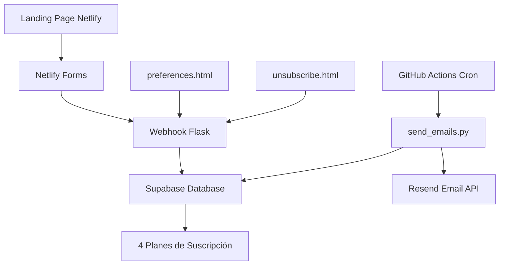

# Pseudosapiens - Frases Motivacionales

Servicio automático de frases motivacionales por email con múltiples frecuencias de suscripción. Sistema completo de landing page optimizada + backend automatizado + base de datos empresarial.

## Arquitectura del Sistema



### Componentes Principales

1. **Landing Page** (`index.html`) - Página de conversión optimizada
2. **Base de Datos** (Supabase) - Gestión de usuarios y suscripciones
3. **Email Engine** (`scripts/send_emails.py`) - Envío automatizado
4. **Webhook API** (`webhook/`) - Integración Netlify → Supabase
5. **GitHub Actions** - Automatización de envíos cada hora

## Características Principales

### Landing Page Ultra-Optimizada
- **Social Proof Animado**: Métricas dinámicas para generar confianza
- **Exit-Intent Detection**: Modal con oferta alternativa al intentar salir
- **Validación en Tiempo Real**: Feedback inmediato con accesibilidad WCAG 2.2
- **Responsive Design**: Mobile-first con touch targets optimizados
- **Dark Mode**: Soporte automático para preferencias del sistema
- **A/B Testing**: Rotación de subjects para optimizar engagement

### Sistema de Planes
| Plan | Descripción | Precio |
|------|-------------|--------|
| **Gratuito** | 3 frases/día (cada 6 horas) | S/ 0 |
| **Premium** | Acceso a TODAS las frecuencias:<br>• 19 frases/día (cada hora)<br>• 8 frases/día (cada 3 horas)<br>• 1 frase/día (diario) | S/ 5.00 |

### Email Engine Avanzado
- **Horarios Psicológicos**: Envíos en horarios óptimos (Peru timezone)
- **Sender Dinámico**: Email "from" personalizado por autor de la frase
- **Anti-Agrupación**: Timestamps únicos para evitar threading en Gmail
- **Rate Limiting**: Respeta límites de Resend con backoff inteligente
- **Logging Estructurado**: JSON logs para monitoreo profesional
- **Fallback System**: Main moderno con fallback a legacy automático

## 📦 Instalación y Configuración

### 1. Dependencias
```bash
pip install -r requirements.txt
```

**Dependencias principales:**
```
resend                # Email delivery service
supabase>=2.0.0      # Database client
structlog>=25.0.0    # Structured logging  
pydantic[email]>=2.0.0 # Data validation
flask                # Webhook API
python-dotenv        # Environment management
```

### 2. Variables de Entorno Requeridas

```bash
# Resend Email Service
RESEND_API_KEY=re_xxxxxxxxx
SENDER_EMAIL="Pseudosapiens <reflexiones@pseudosapiens.com>"

# Supabase Database  
SUPABASE_URL=https://xxx.supabase.co
SUPABASE_KEY=eyJhbGciOiJIUzI1NiIsInR5cCI6IkpXVCJ9...

# Netlify (solo para compatibilidad legacy)
NETLIFY_SITE_ID=xxxxxxxx-xxxx-xxxx
NETLIFY_ACCESS_TOKEN=xxxxxxxxxxxxx

# Opcionales - Tuning
RESEND_THROTTLE_SECONDS=0.6
RESEND_MAX_RETRIES=8
UNSUBSCRIBE_SECRET=tu-clave-secreta-hmac
PHRASES_CSV=frases_pilot_autores.csv
```

### 3. Base de Datos (Supabase)

1. Crear proyecto en [Supabase](https://supabase.com)
2. Ejecutar el schema desde `database/schema.sql`
3. Configurar variables `SUPABASE_URL` y `SUPABASE_KEY`

```sql
-- El schema incluye:
-- users (gestión de usuarios)
-- subscription_plans (4 planes configurados)  
-- subscriptions (suscripciones activas)
-- payments (historial de pagos futuros)
-- Indices y triggers automáticos
```

### 4. Despliegue del Webhook

El webhook (`webhook/netlify_to_supabase.py`) debe desplegarse en un servicio como:
- **Vercel** (recomendado) - `vercel.json` incluido
- **Heroku** - `Procfile` incluido  
- **Railway** / **Render** / etc.

**Endpoints disponibles:**
- `POST /webhook/netlify-form` - Procesar suscripciones
- `POST /unsubscribe` - Procesar desuscripciones
- `GET /webhook/health` - Health check
- `GET /webhook/stats` - Estadísticas del sistema

### 5. GitHub Actions

El archivo `.github/workflows/send_emails.yml` está configurado para:
- ⏰ Ejecutar cada hora automáticamente
- 🧪 Permitir ejecución manual para testing
- 📊 Usar secrets configurados en el repo

**Secrets requeridos en GitHub:**
- `RESEND_API_KEY`
- `SENDER_EMAIL` 
- `SUPABASE_URL`
- `SUPABASE_KEY`

### 6. Configuración de Netlify

```toml
# netlify.toml
[build]
  command = ""
  publish = "."

[[redirects]]
  from = "/preferences"
  to = "/preferences.html"
  status = 200

[[redirects]]  
  from = "/unsubscribe"
  to = "/unsubscribe.html"
  status = 200
```

## 🧪 Testing y Desarrollo

### Modo de Prueba
```bash
# Testing local con emails de prueba
export TEST_MODE=true
export TEST_EMAILS="tu-email@gmail.com,otro@test.com"
python scripts/send_emails.py --test

# Dry run para ver logs sin enviar
python scripts/send_emails.py --dry-run

# Ver estadísticas de la base de datos
curl https://tu-webhook-url.vercel.app/webhook/stats
```

### Debugging con Logs Estructurados
```bash
# Ver todos los logs detallados
python scripts/send_emails.py --dry-run | jq

# Ejemplo de output:
{
  "event": "Email sent successfully",
  "recipient": "user@example.com",
  "phrase_id": "P042",
  "author": "Steve Jobs", 
  "sender": "\"Steve Jobs\" <reflexiones@pseudosapiens.com>",
  "timestamp": "2025-08-25T15:46:55Z",
  "level": "info"
}
```

### Health Checks
```bash
# Verificar estado del webhook
curl https://tu-webhook.vercel.app/webhook/health

# Ver estadísticas de suscriptores
curl https://tu-webhook.vercel.app/webhook/stats
```

## 📊 Monitoreo y Métricas

### Métricas Clave Monitoreadas
- **Crecimiento de suscriptores** por plan
- **Emails enviados** por hora/día/mes con métricas de delivery
- **Rate limiting** y manejo inteligente de errores
- **Conversiones** y optimizaciones en landing page
- **Gestión de bajas** y feedback de usuarios

### Logs Estructurados
Todos los logs están en formato JSON para integración con:
- **Elasticsearch + Kibana**
- **Splunk**
- **DataDog** 
- **New Relic**
- **Grafana + Loki**

## 🔒 Seguridad Implementada

- **HMAC Tokens** para desuscripción segura (30 días de validez)
- **CORS configurado** para webhooks cross-origin
- **Validación de datos** server-side con Pydantic
- **Rate limiting** para prevenir abuso
- **Environment secrets** para todas las credenciales
- **SQL injection protection** con Supabase ORM

## 📈 Optimizaciones de Conversión

### Landing Page
- **Exit-intent modal** con oferta alternativa (1 email/semana)
- **Social proof animado** con métricas dinámicas de confianza
- **Validación en tiempo real** con UX mejorada
- **Mobile optimization** con touch targets WCAG compliant

### Email Delivery
- **Horarios psicológicos** para mayor impacto emocional
- **Sender personalizado** por autor de cada frase
- **Subject line rotation** para evitar fatiga
- **Anti-threading** con timestamps únicos

## 🛠️ Arquitectura de Datos

### Flujo de Datos
1. **Usuario se suscribe** → Landing page
2. **Formulario enviado** → Netlify Forms → Webhook 
3. **Webhook procesa** → Crea usuario en Supabase
4. **GitHub Action ejecuta** → Cada hora UTC
5. **Script consulta** → Supabase para usuarios activos
6. **Filtra por horario** → Según plan de suscripción
7. **Envía emails** → Resend API con contexto personalizado

### Base de Datos Schema
```sql
users (id, email, created_at)
  ↓
subscriptions (user_id, plan_id, status, started_at, expires_at)
  ↓
subscription_plans (id, name, frequency_hours, price_soles, max_emails_per_day)
  ↓ 
payments (subscription_id, payment_id, amount, status)
```

## 🚀 Próximos Pasos

### Funcionalidades Planificadas
- [ ] **Dashboard de Admin** para gestión de contenido
- [ ] **A/B Testing** de subject lines y horarios
- [ ] **Integración de pagos** para suscripciones premium
- [ ] **Analytics avanzado** con métricas de engagement
- [ ] **Personalización IA** de contenido por usuario
- [ ] **API pública** para integraciones third-party

### Optimizaciones Técnicas
- [ ] **CDN para assets** estáticos
- [ ] **Database connection pooling**
- [ ] **Email template engine** más flexible
- [ ] **Background job queues** para procesos pesados
- [ ] **Automated testing** suite completa

## 📝 Notas Técnicas

### Zona Horaria
- **GitHub Actions**: Ejecuta en UTC cada hora
- **Horarios de envío**: Optimizados para Peru (UTC-5)
- **Frases seleccionadas**: Determinísticamente por hora UTC

### Idempotencia
- **Idempotency-Key** por email y slot temporal
- **Evita duplicados** en reintentos o fallos
- **Message-ID único** para threading control

### Rate Limiting
- **Resend**: 2 requests/segundo máximo
- **Backoff automático** en HTTP 429
- **Retry-After header** respetado

---

**Estado actual**: ✅ En producción con sistema automatizado  
**Arquitectura**: Escalable y preparada para crecimiento  
**Última actualización**: Agosto 2025