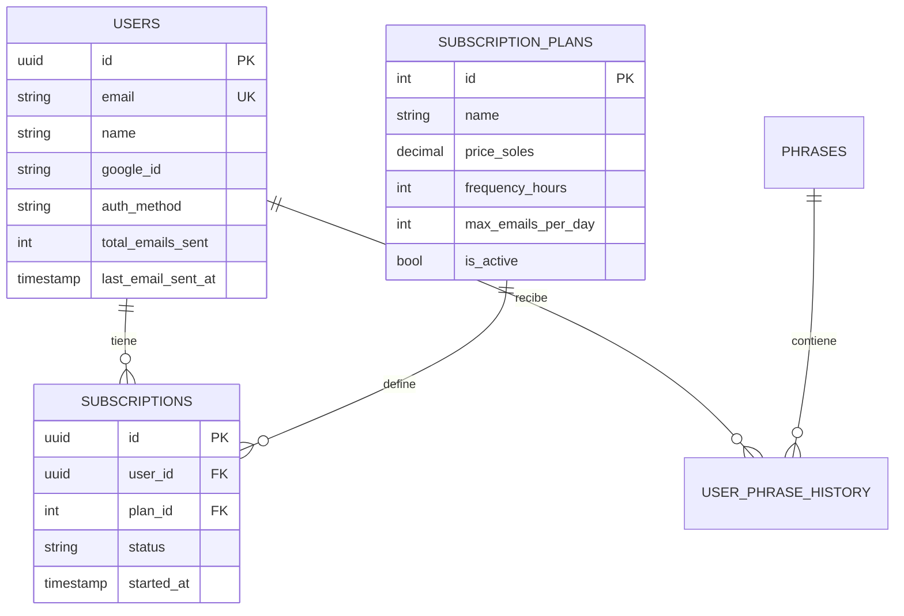

# 📊 ESTRUCTURA COMPLETA DE BASE DE DATOS SUPABASE
**Pseudosapiens - Sistema de Frases Motivacionales**
*Análisis realizado: 16 de Septiembre 2025*

---

## 🗃️ TABLAS EXISTENTES (5 tablas principales)

### 1. 👥 **USERS** (16 usuarios registrados)
```sql
Columnas:
- id (UUID, PK)
- email (VARCHAR, UNIQUE)
- created_at (TIMESTAMP)
- updated_at (TIMESTAMP)
- name (VARCHAR) 
- google_id (VARCHAR)
- avatar_url (TEXT)
- auth_method (VARCHAR) - 'google', 'email', 'both'
- total_emails_sent (INTEGER)
- last_email_sent_at (TIMESTAMP)
```

**📈 Estadísticas usuarios:**
- Total usuarios: 16
- Usuarios con Google Auth: 11 (69%)
- Método de autenticación: Principalmente Google OAuth
- Usuarios activos recientes con envío de emails

### 2. 📋 **SUBSCRIPTION_PLANS** (6 planes disponibles)
```sql
Columnas:
- id (INTEGER, PK)
- name (VARCHAR)
- display_name (VARCHAR)
- price_soles (DECIMAL)
- frequency_hours (INTEGER)
- max_emails_per_day (INTEGER)
- description (TEXT)
- is_active (BOOLEAN)
- created_at (TIMESTAMP)
```

**🎯 Planes configurados:**
- **Plan 0**: Gratuito - S/ 0.00 - 3/semana (56h) - ✅ Activo
- **Plan 1**: Premium Básico - S/ 5.00 - 1/día (24h) - ✅ Activo  
- **Plan 2**: Premium Plus - S/ 10.00 - 2/día (12h) - ✅ Activo
- **Plan 3**: Premium 3/día - S/ 5.00 - 3/día (8h) - ❌ Inactivo
- **Plan 4**: Premium 4/día - S/ 5.00 - 4/día (6h) - ❌ Inactivo
- **Plan 13**: Power User - S/ 5.00 - 13/día (1h) - ❌ Inactivo (VIP)

### 3. 🔥 **SUBSCRIPTIONS** (19 suscripciones, 15 activas)
```sql
Columnas:
- id (UUID, PK)
- user_id (UUID, FK -> users.id)
- plan_id (INTEGER, FK -> subscription_plans.id)
- status (VARCHAR) - 'active', 'cancelled', 'paused'
- started_at (TIMESTAMP)
- expires_at (TIMESTAMP)
- cancelled_at (TIMESTAMP)
- created_at (TIMESTAMP)
- updated_at (TIMESTAMP)
```

**📊 Distribución por planes:**
- Plan 0 (Gratuito): 1 suscriptor
- Plan 1 (Premium Básico): 12 suscriptores (80%)
- Plan 13 (Power User): 2 suscriptores (VIP)

### 4. 📝 **USER_PHRASE_HISTORY** (195 frases enviadas)
```sql
Columnas:
- id (UUID, PK)
- user_id (UUID, FK -> users.id)
- phrase_id (UUID, FK -> phrases.id)
- sent_at (TIMESTAMP)
- email_status (VARCHAR) - 'sent', 'failed', 'pending'
- plan_id (INTEGER) - Plan usado al momento del envío
- created_at (TIMESTAMP)
```

**📈 Actividad de envíos:**
- Total frases enviadas: 195
- Estado: Todas marcadas como 'sent'
- Actividad reciente: Septiembre 16, 2025

### 5. 💭 **PHRASES** (201 frases disponibles)
```sql
Columnas:
- id (UUID, PK)
- text (TEXT) - Contenido de la frase
- author (VARCHAR) - Autor de la frase
- created_at (TIMESTAMP)
```

**📚 Contenido:**
- Total frases: 201
- Autores incluyen: Steve Jobs, Nelson Mandela, etc.
- Base de conocimiento lista para uso

---

## ❌ TABLAS NO IMPLEMENTADAS

Estas tablas aparecen en los esquemas SQL pero NO existen en la base real:
- `payments` - Sistema de pagos
- `email_logs` - Logs detallados de envío  
- `webhook_secrets` - Secretos para validación
- `payment_logs` - Auditoría de pagos
- `email_stats` - Estadísticas de email
- `user_stats` - Estadísticas de usuario
- `phrase_categories` - Categorización de frases
- `email_templates` - Plantillas de email

---

## 🔗 RELACIONES DE DATOS



---

## ⚡ ANÁLISIS DEL WEBHOOK

**✅ Compatibilidad con estructura real:**
- `get_user_by_email()` → ✅ Tabla `users` existe
- `get_user_subscription()` → ✅ Tabla `subscriptions` existe  
- `create_or_update_subscription()` → ✅ Funcional
- `map_frequency_to_plan_id()` → ✅ Planes configurados correctamente

**❌ Funciones no implementadas en DB:**
- Sistema de pagos (tabla `payments` no existe)
- Logs de email detallados
- Webhooks de validación

---

## 🎯 RECOMENDACIONES

### **Alta Prioridad**
1. **Implementar tabla `payments`** - Para sistema de cobros
2. **Crear `email_logs`** - Para tracking detallado de envíos
3. **Agregar `webhook_secrets`** - Para seguridad

### **Media Prioridad**  
4. **Tabla `email_stats`** - Para analíticas avanzadas
5. **Categorización de frases** - Para personalización
6. **Templates de email** - Para flexibilidad de diseño

### **Optimizaciones**
7. **Índices adicionales** en `user_phrase_history` para performance
8. **RLS (Row Level Security)** para seguridad de datos
9. **Triggers de auditoría** para cambios importantes

---

## 📊 ESTADO ACTUAL: **FUNCIONAL** ✅

**Lo que funciona:**
- ✅ Registro de usuarios (Google OAuth)
- ✅ Gestión de suscripciones
- ✅ Envío de frases motivacionales  
- ✅ Tracking básico de actividad
- ✅ Dashboard frontend conectado

**Lo que falta:**
- ❌ Sistema de pagos completo
- ❌ Logs detallados de email
- ❌ Analíticas avanzadas
- ❌ Seguridad webhook

---

*Este análisis refleja el estado real de la base de datos al 16/09/2025*